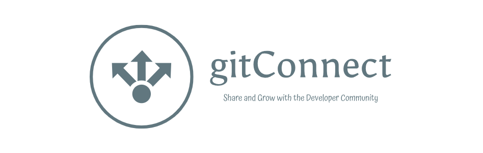

# gitConnect
Next.js Social Network for Developers.
GitConnect allows developers to  create a developer profile/portfolio, share posts and get help from others developers



https://gitconnect-tan.vercel.app

## Project Resources
### Figma
[Link to Figma Designs](https://www.figma.com/design/1nkE9Ab7HLbtxJtSzWawnk/gitConnect?node-id=0-1&t=Eyfjd1ZZcxTkCgI0-1)
### Project Management
For the initial phase, the simple GitHub Project Management tool was used.
[gitConnect GitHub Project](https://github.com/users/JoshuaOndieki/projects/2/views/1?filterQuery=)
### Documentation
Architecture diagrams, onboarding instructions, research and brainstorming docs are done using Notion.
[gitConnect Notion Docs](https://troubled-milk-3ff.notion.site/gitConnect-ea20192794c14730ab3d732db1030d03?pvs=4)

## Running Locally
### 1. Setup Appwrite
1. Install Appwrite locally on Docker.
> [!TIP]
> For easier setup.
> `cd appwrite-docker` then run `docker compose up -d`
> See more info at https://appwrite.io/docs/advanced/self-hosting
2. Go to http://localhost and signup.
3. Create a new organization and project both with id **gitconnect**
> [!NOTE]
> In case you face issues with SMTP, you may need to enable it manually.
> Go to http://localhost/console/project-gitconnect/settings/smtp and enable the Custom STMP server.
> 
> You should be able to access your emails at http://localhost:8025
```
host - host.docker.internal
port - 1025
username and password blank
protocol - none
```

4. Install Appwrite cli `npm i -g appwrite-cli`
5. `appwrite login --endpoint "http://localhost/v1"`
6. While inside the appwrite directory, run `appwrite push all --all --force` to sync your local setup with this project's resources.
> [!CAUTION]
> When you push for the first time, your functions may not have scopes attached to them. Current hack is:
> 
> Proceed to on of the functions UI page e.g. http://localhost/console/project-gitconnect/functions/function-user-profile-trigger/settings
> 
> Select any scope and update.
> Go back to your terminal and run `appwrite push all --all --force`
> This should detect all the scopes and update them accordingly.

### 2. Setup & Run Nextjs app
1. Go to client directory
2. `npm i`
3. Create a `.env` based on the provided `.env.example`
4. Use the env variables for Appwrite from your local Appwrite account.
5. `npm run dev`
